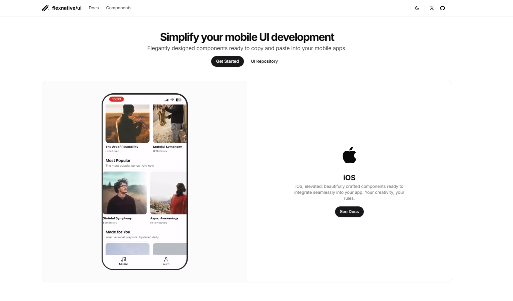

# FlexNative UI - Mobile

[FlexNative UI](https://ui.flexnative.com)



A practical collection of reusable UI components designed to elevate your mobile development experience. This repository is more than just code—it’s a **hands-on playground** for building and customizing mobile apps.

---

## Why This Repository?

This repository was created to make your development journey smoother and more efficient. It’s packed with:

- **Real-World Examples**: Explore how components are structured, styled, and interact in practical scenarios.
- **Implementation Insights**: Learn about the tools, packages, and techniques behind each component.
- **Always Up-to-Date**: Stay current with features as the repository evolves alongside the documentation.

FlexNative UI is designed to be a **powerful resource** for developers looking to streamline their workflow and build smarter.

---

## Getting Started

Follow these steps to set up the project locally:

### Prerequisites

Make sure you have the following installed:

- **Git**: [Download Git](https://git-scm.com/downloads)
- **Node.js**: [Download Node.js](https://nodejs.org)

### Installation

1. Clone the repository:

   ```bash
   git clone https://github.com/felipemenezes098/flexnative-app.git
   ```

2. Navigate into the project directory:

   ```bash
   cd flexnative-app
   ```

3. Install the dependencies:

   ```bash
   npm install
   ```

4. Start the development server:

   ```bash
   npx expo start
   ```

5. If you’re on a different network or need to expose the app, use:

   ```bash
   npx expo start --tunnel
   ```

6. Open the **Expo Go** app on your device and scan the QR code.

---

## Build Smarter

This repository gives you everything you need to create dynamic, scalable mobile apps:

- **Customizable Components**: Adapt the provided components to fit your project’s needs.
- **Free to Use**: Use this repository for personal or commercial projects with no restrictions or attribution required.

---

## Feedback & Contributions

This repository is meant to inspire and support developers. If you’ve got feedback, suggestions, or want to contribute, feel free to open an issue or submit a pull request. Let’s build something amazing together!

---

## License

This project is licensed under the [MIT License](LICENSE).

---

Start building today. Explore, experiment, and create. 🚀
